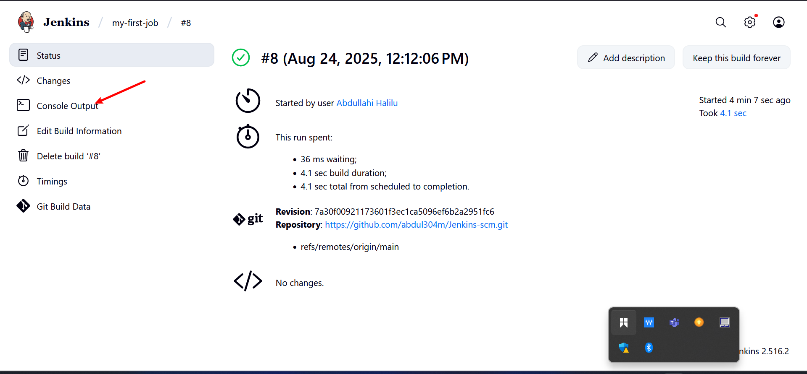

# Jenkins_Freestyle_project 

# Jankin Job:
 A Jenkins job is a task or unit of work that you define and automate in Jenkins, which is an open-source automation server used mainly for Continuous Integration (CI) and Continuous Delivery (CD).

In simple terms, a Jenkins job is a configuration that tells Jenkins what to do, such as:

- Building code from a repository

- Running tests

- Packaging applications

- Deploying software to servers or cloud platforms

- Running maintenance scripts or cron-like tasks

# Creating a Freestyle Project 
Let's create our first build job:
1. From the Dashboard menu on the left side, click on new item.

.

2. create a freestyle project and name it "my-fist-job"

.

.

# Connecting Jenkins To Our Source Code Management

Now that we have created a freestyle project, let connect jenkins with github.

i. Create a new github repository called jenkins-scm with a README.md file

ii. Connect jenkins to jenkins-scm repository by pasting the repository url in the area selected below. Make sure your current branch is main

iii. Save configuration and run "build now" to connect jenkins to our" help me do this .

## Step 1: Create a new GitHub repo
- Go to Gthub
- Click New repository.
- nName it: jenkins-scm.
- Check Add a README file ✅.
- Click Create repository.
👉 Now you have a repo like: https://github.com/abdul304m/Jenkins-scm.git

## Step 2: Connect Jenkins to this repo
- Go to Jenkins → open your freestyle project (my-first-job) or create a new one.

- Click Configure.

- Scroll to Source Code Management section.

- Select Git.

- In Repository URL, paste your new repo URL: https://github.com/abdul304m/Jenkins-scm.git

.

.

## Step 3: Save and Build
- Scroll to the bottom and click Save.

.

- On the job page, click Build Now.

.

- After the build finishes, click the build number → Console Output.

.

- You should see Jenkins pulling from:

.

# Configuring Build Trigger

As a engineer, we need to be able to automate things and make our work easier in possible ways. We have connected jenkins to jenkins-scm, but we cannot run a new build with clicking on Build Now. To eliminate this, we need to confuse a build trigger to our jenkins job. With this, jenkins will run a new build anytime a change is made to our github repository.

i. Click "Configure" your job and add this configurations

ii. Click on build trigger to configure triggering the job from GitHub webhook"

## Step 1: Enable GitHub Webhook Trigger in Jenkins
- In Jenkins, open your job (my-first-job).

- On the left, click Configure.

- Scroll down to the Build Triggers section.
- Check:

  . GitHub hook trigger for GITScm polling

.

- This tells Jenkins: “Whenever GitHub notifies me of a change, run this job.

## Step 2: Configure Webhook in GitHub
- Open your GitHub repo (jenkins-scm).
- Go to Settings → Webhooks → Add webhook.

.

- In the Payload URL, enter your Jenkins server webhook URL:
.

Now, go ahead and make some change in any file in your GitHub repository (e.g. README.MD file) and push the changes to the master branch.

You will see that a new build has been launched automatically (by webhook)

# Step 1: Make a change in GitHub
- Go to your jenkins-scm repository on GitHub.
- Open README.md.

- Click the (edit) button.

.

- Add a simple line, for example: "Testing Jenkins Webhook"

.

# Step 2: Watch Jenkins
- Go back to Jenkins → open your job (my-first-job or the one linked to jenkins-scm).

- In the Build History, you should see a new build (#9 or higher) automatically triggered — without clicking “Build Now”.

.

# Step 3: Confirm in Console Output
Click the new build → Console Output.
You’ll see logs showing the GitHub webhook triggered the job.

.
